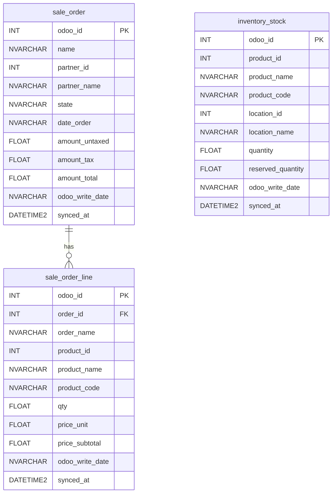

# Odoo → Azure SQL Inventory Sync

An Azure Function App (Python) that pulls inventory stock levels from Odoo and upserts them into Azure SQL Database.

---

## Architecture

```
HTTP Trigger
    └── Fetch stock.quant from Odoo (XML-RPC + API Key)
            └── Upsert into Azure SQL (inventory_stock table)
```

---

## Project Structure

```
├── function_app.py       # Azure Function entry point
├── odoo_client.py        # Odoo XML-RPC connection & data fetching
├── sql_client.py         # Azure SQL table management & upsert
├── requirements.txt      # Python dependencies
├── host.json             # Azure Functions runtime config
├── local.settings.json   # Local secrets (gitignored)
└── .gitignore
```

---

## Prerequisites

- Python 3.11+
- [Azure Functions Core Tools v4](https://learn.microsoft.com/en-us/azure/azure-functions/functions-run-local)
- [ODBC Driver 18 for SQL Server](https://learn.microsoft.com/en-us/sql/connect/odbc/download-odbc-driver-for-sql-server)
- An Odoo instance with API key access enabled
- An Azure SQL Database (server + database already provisioned)

---

## Configuration

Fill in `local.settings.json` before running locally. **Never commit this file.**

| Variable | Description | Example |
|---|---|---|
| `ODOO_URL` | Odoo instance base URL | `https://your-company.odoo.com` |
| `ODOO_DB` | Odoo database name (subdomain for Odoo Online) | `your-company` |
| `ODOO_USERNAME` | Odoo login email | `admin@example.com` |
| `ODOO_API_KEY` | Odoo API key (see below) | `469756b7...` |
| `SQL_SERVER` | Azure SQL server hostname | `your-server.database.windows.net` |
| `SQL_DATABASE` | Azure SQL database name | `your-database` |
| `SQL_USERNAME` | SQL login username | `sqladmin` |
| `SQL_PASSWORD` | SQL login password | `your-password` |

### How to get an Odoo API Key

1. Log in to Odoo
2. Go to **Settings → Users → (your user) → Account Security**
3. Click **New API Key**, give it a name, copy the key

### Odoo DB name (Odoo Online)

For `https://your-company.odoo.com`, the database name is `your-company` (the subdomain).

---

## Run Locally

```bash
# Install dependencies
pip install -r requirements.txt

# Start the function
func start
```

Trigger the sync:

```
GET http://localhost:7071/api/sync-inventory?code=<function-key>
```

Expected response:
```
Done. Fetched 142 records, upserted 142 rows.
```

---

## Azure SQL Tables

The function auto-creates all tables on first run if they do not exist.

### Entity Relationship Diagram



### Table Descriptions

| Table | Synced by | Description |
|---|---|---|
| `inventory_stock` | `GET /api/sync-inventory` | Current stock levels per product per location |
| `sale_order` | `GET /api/sync-orders` | Sale order / quotation headers per customer |
| `sale_order_line` | `GET /api/sync-orders` | Individual product lines within each sale order |

Upsert key for all tables: `odoo_id` — re-running is safe and idempotent.

---

## Deploy to Azure

```bash
# Login
az login

# Deploy
func azure functionapp publish <your-function-app-name>
```

After deploying, set all environment variables under:
**Azure Portal → Function App → Settings → Environment variables**

---

## Roadmap

- [ ] POST stock updates back to Odoo
- [ ] Timer trigger (scheduled sync)
- [ ] Support for additional Odoo models (products, orders, etc.)
- [ ] Error alerting (email / Teams webhook)

To disable/enable the triggers:

  -- Disable both
  DISABLE TRIGGER trg_S3a_AfterInsert ON S3A_STATIC_LOGS;
  DISABLE TRIGGER trg_S3b_AfterInsert ON S3B_STATIC_LOGS;

  -- Re-enable both
  ENABLE TRIGGER trg_S3a_AfterInsert ON S3A_STATIC_LOGS;
  ENABLE TRIGGER trg_S3b_AfterInsert ON S3B_STATIC_LOGS;